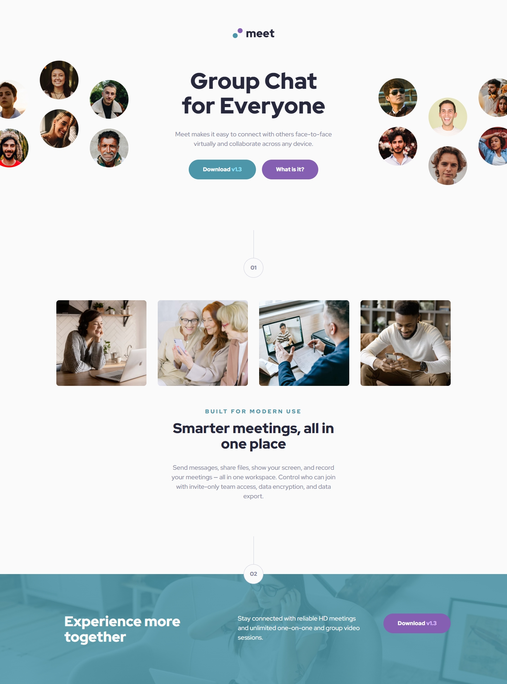
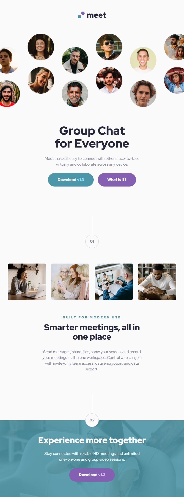
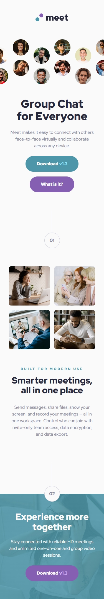

# Frontend Mentor - Meet landing page solution

This is a solution to the [Meet landing page challenge on Frontend Mentor](https://www.frontendmentor.io/challenges/meet-landing-page-rbTDS6OUR). Frontend Mentor challenges help you improve your coding skills by building realistic projects.

## Table of contents

- [Overview](#overview)
  - [The challenge](#the-challenge)
  - [Screenshot](#screenshot)
  - [Links](#links)
- [My process](#my-process)
  - [Built with](#built-with)
  - [What I learned](#what-i-learned)
  - [Continued development](#continued-development)
  - [Useful resources](#useful-resources)
- [Author](#author)
- [Acknowledgments](#acknowledgments)

**Note: Delete this note and update the table of contents based on what sections you keep.**

## Overview

### The challenge

Users should be able to:

- View the optimal layout depending on their device's screen size
- See hover states for interactive elements

### Screenshot





### Links

- Solution URL: [https://github.com/skhbabez/meet-landing-page/](https://github.com/skhbabez/meet-landing-page/)
- Live Site URL: [https://skhbabez.github.io/meet-landing-page/](https://skhbabez.github.io/meet-landing-page/)

## My process

### Built with

- Semantic HTML5 markup
- CSS custom properties
- Flexbox
- CSS Grid
- Mobile-first workflow

**Note: These are just examples. Delete this note and replace the list above with your own choices**

### What I learned

This was the first project I got to use auto-fit with grid. I also got to experiment around with a bunch of features i otherwise did not ge to use that much like blendmodes, Pseudoelements or positioning utilities. The most fun i had though was to make all the spacings and fonts responsive.

The most interesting thing to me was how images loaded with ::before or ::after are not resizable. But yyou can circumvent this by using a background image instead and setting an aspect ratio.

```css
.hero::before {
  content: "";
  background: url("assets/tablet/image-hero.png") no-repeat center / contain;
  width: 107%;
  min-inline-size: 27.0625rem;
  aspect-ratio: 820 / 303;
}
```

### Continued development

I am personally still not sure about some best practices in regards to the techniques i employed here. Especially when it comes to images and will do some research. I also experimented with different spacing strategies but defaulted to using flex gap a lot. I personally dont like this that much and will look into alternative strategies. Or at leat put more focus into making repetitive structures like that more reusable.

### Useful resources

- [Alt text](https://www.searchenginejournal.com/alt-text-for-logos-and-buttons/469801/) - Interesting text on how to label logos.
- [Utopia](https://utopia.fyi/) - I used their tools to create most of my clamp functions
  --[https://responsively.app/] - This is such a great app.
